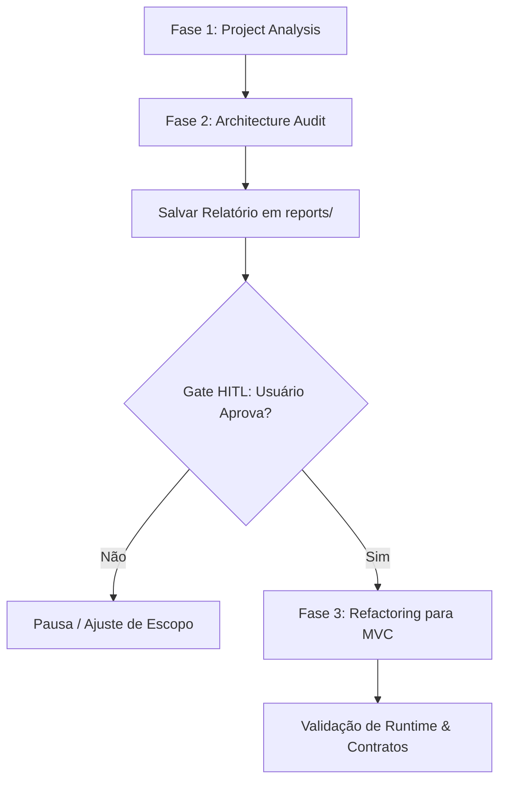

# Refactor-Arch: Architectural Refactoring Skill

A skill `refactor-arch` é uma ferramenta especializada e agnóstica de tecnologia, projetada para analisar, auditar e refatorar aplicações legadas backend (Python/Flask, Node.js/Express, entre outros) para o padrão de arquitetura **Model-View-Controller (MVC)**.

---

## Estrutura Modular de Referências

Antes de executar cada fase, consulte os arquivos de referência correspondentes:
- **Heurísticas de Descoberta:** [project-analysis.md](./references/project-analysis.md)
- **Catálogo de Anti-Patterns:** [antipatterns-catalog.md](./references/antipatterns-catalog.md)
- **Schema do Relatório de Auditoria:** [report-template.md](./references/report-template.md)
- **Diretrizes Arquiteturais do MVC:** [architecture-guidelines.md](./references/architecture-guidelines.md)
- **Playbook de Transformação:** [refactoring-playbook.md](./references/refactoring-playbook.md)

---

## Fluxo Operacional em 3 Fases



---

### FASE 1: PROJECT ANALYSIS (Análise do Projeto)

1. **Escaneamento do Diretório:**
   - Detectar a linguagem dominante e ecossistema (`Python`, `Node.js/JavaScript`).
   - Identificar frameworks web utilizados (`Flask`, `Express`, etc.).
   - Mapear o driver de banco de dados (`SQLite`, `SQLAlchemy`, etc.).
   - Listar todos os endpoints existentes (rotas, métodos HTTP, payloads e códigos de resposta).
2. **Classificação Arquitetural:**
   - Avaliar a estrutura atual (Monólito Desestruturado, Parcialmente Estruturado, etc.).
3. **Exibição do Resumo:**
   Imprimir no terminal o bloco padronizado:
   ```text
   ================================
   PHASE 1: PROJECT ANALYSIS
   ================================
   Language:      <Linguagem detectada>
   Framework:     <Framework detectado>
   Dependencies:  <Principais pacotes>
   Domain:        <Domínio inferido: E-commerce, LMS, Task Manager, etc.>
   Architecture:  <Classificação atual>
   Source files:  <N> files analyzed (~<Total> lines of code)
   Endpoints:     <Total de rotas mapeadas>
   DB / Storage:  <Tipo de banco/ORM>
   ================================
   ```

---

### FASE 2: ARCHITECTURE AUDIT (Auditoria Arquitetural)

1. **Inspeção contra o Catálogo:**
   - Comparar cada arquivo da base contra as heurísticas de [antipatterns-catalog.md](./references/antipatterns-catalog.md).
   - Classificar cada problema por severidade: `CRITICAL`, `HIGH`, `MEDIUM`, `LOW`, ou `DEPRECATED`.
   - Registrar com precisão milimétrica o **arquivo e números de linha exatos** onde o problema ocorre.
2. **Geração e Persistência do Relatório:**
   - Montar o relatório segundo o modelo definido em [report-template.md](./references/report-template.md).
   - Salvar o relatório no diretório `reports/` do repositório:
     - Projeto 1 (`code-smells-project`) → `reports/audit-project-1.md`
     - Projeto 2 (`ecommerce-api-legacy`) → `reports/audit-project-2.md`
     - Projeto 3 (`task-manager-api`) → `reports/audit-project-3.md`
3. **Exibição no Terminal:**
   Imprimir o resumo executivo e a contagem de achados por severidade.

---

### MANDATORY HITL APPROVAL GATE (Portão de Aprovação Humana)

> [!IMPORTANT]
> **REGRA NÃO-NEGOCIÁVEL DE SEGURANÇA:**
> Ao concluir a Fase 2, a skill **DEVE OBRIGATORIAMENTE PARAR**.
> NENHUM arquivo do código-fonte pode ser criado, modificado ou removido antes da confirmação formal do usuário.

A skill deve apresentar a seguinte mensagem de bloqueio interativo:
```text
================================================================
Phase 2 complete. Audit report saved to reports/audit-project-<N>.md.
Summary: <C> Critical | <H> High | <M> Medium | <L> Low findings.
Proceed with refactoring (Phase 3)? [y/n]
================================================================
```
- Se a resposta for **afirmativa (`y` / `yes` / aprovação formal do usuário)**: avançar para a Fase 3.
- Se a resposta for **negativa ou inexistente**: interromper imediatamente a execução sem modificar arquivos.

---

### FASE 3: REFACTORING & VERIFICATION (Refatoração e Validação)

1. **Execução das Transformações:**
   - Aplicar as regras arquiteturais de [architecture-guidelines.md](./references/architecture-guidelines.md) e as receitas de [refactoring-playbook.md](./references/refactoring-playbook.md).
   - Criar a estrutura MVC modular:
     - `config/`: configurações isoladas de variáveis de ambiente.
     - `models/`: modelos de dados e persistência parametrizada.
     - `controllers/`: orquestração de fluxo desacoplada de HTTP.
     - `routes/` (ou `views/`): roteamento limpo com Blueprints ou Express Routers.
     - `middlewares/`: tratamento global de exceções e logs.
     - `app.py` / `app.js`: composition root enxuto.
2. **Preservação Rígida de Contratos:**
   - Garantir 100% de paridade nos verbos HTTP, rotas, schemas JSON de entrada/saída e status codes.
3. **Validação de Runtime:**
   - Iniciar a aplicação refatorada e confirmar boot limpo (sem erros de sintaxe ou importação).
   - Executar chamadas HTTP em todos os endpoints principais confirmando status 200/201/400/404 esperado.
4. **Relatório de Conclusão:**
   Exibir a nova árvore de diretórios e o checklist de validação preenchido.
